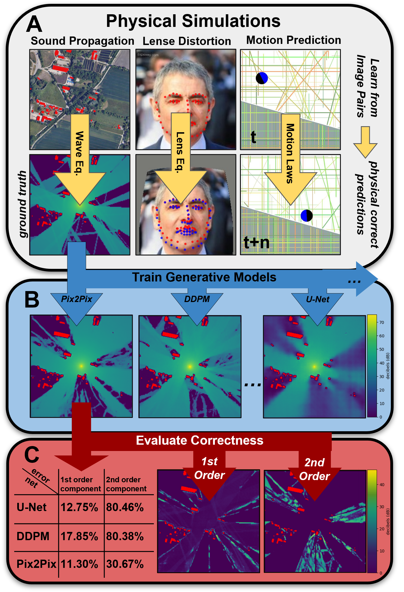

<center>
    <h1>
        PhysicsGen: Can Generative Models Learn from Images <br>
        to Predict Complex Physical Relations?
    </h1>
</center> 

<table>
    <tr>
        <td width="50%" valign="top">
            <h2>Abstract</h2>
            The image-to-image translation abilities of generative learning models have recently made significant progress in the estimation of complex (steered) mappings between image distributions. While appearance based tasks like image in-painting or style transfer have been studied at length, we propose to investigate the potential of generative models in the context of physical simulations. Providing a dataset of 300k image-pairs and baseline evaluations for three different physical simulation tasks, we propose a benchmark to investigate the following research questions: i) are generative models able to learn complex physical relations from input-output image pairs? ii) what speedups can be achieved by replacing differential equation based simulations? While baseline evaluations of different current models show the potential for high speedups (ii), these results also show strong limitations toward the physical correctness (i). This underlines the need for new methods to enforce physical correctness.
        </td>
        <td>
            
        </td>
    </tr>
</table>


## Download Datasets

The dataset used for evaluation is publicly available and published via Zenodo, ensuring easy access and reproducibility of our research findings [](https://doi.org/10.5281/zenodo.11448582).


## Code for baseline experiments

The code is located in the [GitHub repository](https://github.com/physicsgen/physicsgen).

**Project Structure:**

```
project_root/
│
├── data/                         # Dedicated data folder
│   └── urban_sound_25k_baseline/ # Download this via provided DOI
│       ├── test/
│       │   ├── test.csv
│       │   ├── soundmaps/
│       │   └── buildings/
│       │
│       └── pred/                 # Your predictions
│           ├── y_0.png
│           └── ...
│
└── eval_scripts/
    ├── lens_metrics.py
    └── sound_metrics.py
```

The indexing system for predicted sound propagation images in the `pred` folder aligns directly with the `test.csv` dataframe rows. Each predicted image file, named as `y_{index}.png`, corresponds to the test data's row at the same index, with index 0 referring to the dataframe's first row.

### Sound Propagation Evaluation Script

**Description:**
Evaluates sound propagation predictions by comparing them to ground truth noise maps, including Line-of-Sight (LoS) and Non-Line-of-Sight (NLoS) errors.

**Usage:**
```sh
python sound_metrics.py --data_dir data/true --pred_dir data/pred --output evaluation.csv
```

**Arguments:**
- `--data_dir`: Directory containing true sound maps and `test.csv`.
- `--pred_dir`: Directory containing predicted sound maps.
- `--output`: Path to save the evaluation results.


### Lens Evaluation Script

**Description:**
Evaluates the accuracy of facial landmark predictions by comparing them to ground truth images.

**Usage:**
```sh
python lens_metrics.py --data_dir data/true --pred_dir data/pred --output results/
```

**Arguments:**
- `--data_dir`: Directory containing true label images and `test.csv`.
- `--pred_dir`: Directory containing predicted landmark images.
- `--output`: Directory to save the results.


# Results
## Urban Sound Propagation

The table below presents baseline performance metrics for various architectural approaches, encompassing combined mean absolute error (MAE) and weighted mean absolute percentage error (wMAPE), alongside specific line-of-sight (LoS) and non-line-of-sight (NLoS) metrics. 

| Condition      | Architecture | LoS MAE | NLoS MAE | LoS wMAPE | NLoS wMAPE | Runtime / Sample (ms) |
|----------------|--------------|---------|----------|-----------|------------|------------------------|
| Baseline       | Simulation   | 0.00    | 0.00     | 0.00      | 0.00       | 204700                 |
| Baseline       | convAE       | 3.67    | 2.74     | 20.24     | 67.13      | 0.128                  |
| Baseline       | VAE          | 3.92    | 2.84     | 21.33     | 75.58      | 0.124                  |
| Baseline       | UNet         | 2.29    | 1.73     | <ins>12.91</ins> | <ins>37.57</ins> | 0.138 |
| Baseline       | Pix2Pix      | <ins>1.73</ins> | <ins>1.19</ins> | **9.36** | **6.75** | 0.138  |
| Baseline       | DDPM         | 2.42    | 3.26     | 15.57     | 51.08      | 3986.353               |
| Baseline       | SD(w.CA)     | 3.76    | 3.34     | 17.42     | 35.18      | 2961.027               |
| Baseline       | SD           | 2.12    | **1.08** | 13.23     | 32.46      | 2970.86                |
| Baseline       | DDBM         | **1.61** | 2.17    | 17.50     | 65.24      | 3732.21                |
|                |              |         |          |           |            |                        |
| Diffraction    | Simulation   | 0.00    | 0.00     | 0.00      | 0.00       | 206000                 |
| Diffraction    | convAE       | 3.59    | 8.04     | 13.77     | 32.09      | 0.128                  |
| Diffraction    | VAE          | 3.92    | 8.22     | 14.46     | 32.57      | 0.124                  |
| Diffraction    | UNet         | <ins>0.94</ins>    | **3.27** | <ins>4.22</ins>      | 22.36      | 0.138                  |
| Diffraction    | Pix2Pix      | **0.91** | <ins>3.36</ins>    | **3.51**  | **18.06**  | 0.138                  |
| Diffraction    | DDPM         | 1.59    | **3.27** | 8.25      | <ins>20.30</ins>      | 3986.353               |
| Diffraction    | SD(w.CA)     | 2.46    | 7.72     | 10.14     | 31.23      | 2961.027               |
| Diffraction    | SD           | 1.33    | 5.07     | 8.15      | 24.45      | 2970.86                |
| Diffraction    | DDBM         | 1.35    | 3.35     | 11.22     | 23.56      | 3732.21                |
|                |              |         |          |           |            |                        |
| Reflection     | Simulation   | 0.00    | 0.00     | 0.00      | 0.00       | 251000                 |
| Reflection     | convAE       | 3.83    | 6.56     | 20.67     | 93.54      | 0.128                  |
| Reflection     | VAE          | 4.15    | 6.32     | 21.57     | 92.47      | 0.124                  |
| Reflection     | UNet         | 2.29    | 5.72     | <ins>12.75</ins>     | 80.46      | 0.138                  |
| Reflection     | Pix2Pix      | <ins>2.14</ins> | **4.79** | **11.30** | **30.67**  | 0.138                  |
| Reflection     | DDPM         | 2.74    | 7.93     | 17.85     | 80.38      | 3986.353               |
| Reflection     | SD(w.CA)     | 3.81    | 6.82     | 19.78     | 81.61      | 2961.027               |
| Reflection     | SD           | 2.53    | <ins>5.26</ins>     | 15.04     | <ins>55.27</ins>      | 2970.86                |
| Reflection     | DDBM         | **1.93** | 6.38    | 18.34     | 79.13      | 3732.21                |


## Lens Distortion
The table presents a comparative analysis of different models' performance in accurately predicting facial landmarks under varying lens distortion settings, represented by the coefficients \( p_1 \) and \( p_2 \). It details the combined error, X Error, Y Error, and Shift for each model, highlighting how each model copes with horizontal and vertical distortion impacts separately.


| Model   | Comb. | X Err. | Y Err. | Shift | Runtime / Sample (ms) |
|---------|-------|--------|--------|-------|------------------------|
| **$p_1 \neq 0, p_2 = 0$** |                |        |        |       |   
| Simulation | 0.00  | 0.00   | 0.00   | 0.00  | 153.205 |
| convAE     | 11.93 | 6.75   | 8.13   | 1.38  | 0.110   |
| VAE        | 11.53 | 6.55   | 7.83   | 1.28  | 0.122   |
| UNet       | 2.82  | 1.28   | 2.15   | 0.87  | 0.118   |
| Pix2Pix    | <ins>2.00</ins>  | <ins>0.99</ins>  | <ins>1.43</ins>  | **0.44**  | 0.122   |
| DDPM       | **1.93**  | **0.94**   | **1.39**   | <ins>0.45</ins>  | 3970.603 |
| SD(w.CA)   | 3.09  | 1.59   | 2.21   | 0.62  | 2991.678 |
| SD         | 2.79  | 1.41   | 2.01   | 0.60  | 2997.576 |
| **$p_1 = 0, p_2 \neq 0$** |                |        |        |       |  
| Simulation | 0.00  | 0.00   | 0.00   | 0.00  | 153.205 |
| convAE     | 10.56 | 8.35   | 4.77   | 2.21  | 0.110   |
| VAE        | 10.40 | 8.26   | 4.62   | 3.64  | 0.122   |
| UNet       | 2.36  | <ins>1.33</ins>   | 1.60   | 0.27  | 0.117   |
| Pix2Pix    | **1.77**  | **1.02**   | **1.14**   | **0.13**  | 0.123   |
| DDPM       | <ins>2.13</ins>  | 1.39   | <ins>1.23</ins>  | <ins>0.16</ins>  | 3970.603 |
| SD(w.CA)   | 2.85  | 1.60   | 1.94   | 0.34  | 2991.678 |
| SD         | 2.44  | 1.38   | 1.64   | 0.26  | 2997.576 |


## Dynamics of rolling and bouncing movements
The table evaluates the performance of three generative models—GAN, UNet, and DDPM—on four key error metrics: Position X, Position Y, Rotation, and Roundness. These metrics assess each model's ability to accurately predict ball position, rotation, and shape in a controlled simulation environment, highlighting their precision in handling geometric distortions.

| Model      | Position X           | Position Y           | Rotation            | Roundness           | Error |
|------------|-----------------------|-----------------------|----------------------|----------------------|-------|
| convAE     | 4.24 $\pm$ 3.9       | 6.08 $\pm$ 5.9       | 12.2 $\pm$ 8.6      | 1.06 $\pm$ 0.0      | 99%   |
| VAE        | 4.69 $\pm$ 6.1       | 6.25 $\pm$ 6.9       | 31.0 $\pm$ 40      | 0.90 $\pm$ 0.1      | 95%   |
| UNet       | 5.53 $\pm$ 7.5$       | 10.8 $\pm$ 12        | 15.2 $\pm$ 23       | 0.74 $\pm$ 0.2      | 28%   |
| Pix2Pix    | **6.28 $\pm$ 8.0**   | **11.7 $\pm$ 13**    | **17.2 $\pm$ 21**   | **0.56 $\pm$ 0.1**  | 11%   |
| DDPM       | 7.91 $\pm$ 9.0       | 15.5 $\pm$ 14        | 32.9 $\pm$ 34       | 0.61 $\pm$ 0.2      | 5.7%  |
| SD(w.CA)   | 40.0 $\pm$ 49        | 24.8 $\pm$ 23        | 61.1 $\pm$ 52       | **0.53 $\pm$ 0.2**  | 7.3%  |
| SD         | 8.55 $\pm$ 12        | 16.2 $\pm$ 14        | 34.2 $\pm$ 38       | **0.47 $\pm$ 0.1**  | **2%** |


### Contribute to the Leaderboard

TBA

## License
This dataset is licensed under a [Creative Commons Attribution-NonCommercial-NoDerivatives 4.0 International](https://creativecommons.org/licenses/by-nc-nd/4.0/)
